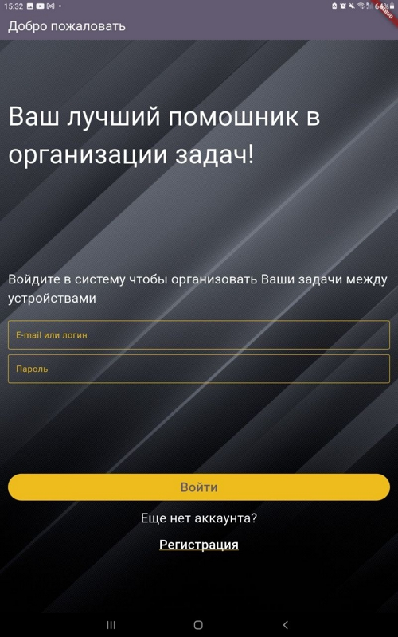
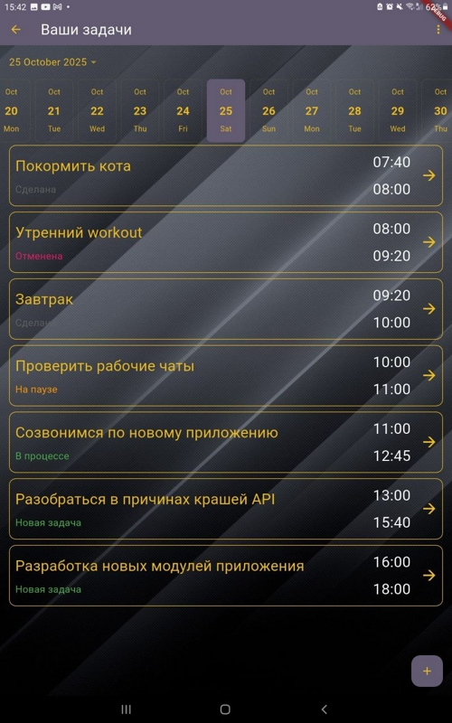
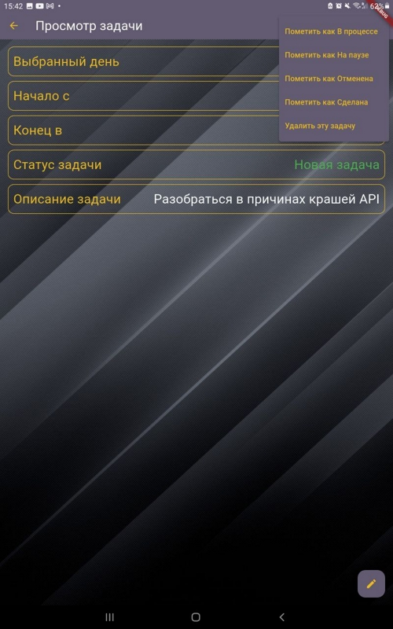
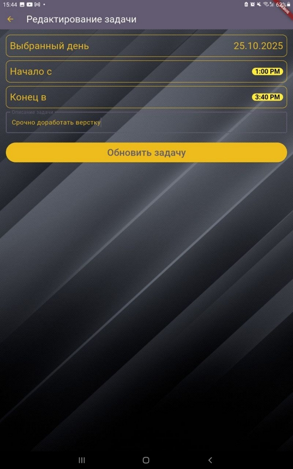

# Task Manager App
Простое мобильное приложение «Task Manager App», которое позволяет пользователю входить в систему, просматривать список задач, добавлять новые задачи и отмечать их как выполненные

# Функционал приложения
1. Экран входа
2. Экран регистрации пользователей
3. Экран политики конфиденциальности со встроенным WebView
4. Экран с календарем и списком задач для каждого дня. Для серверной части используется кастомный самописный Backend на Python с использованием фреймворка FastAPI (код для серверной части приложения доступен в репо в папке "Backend проекта")
5. Возможность добавить новую задачу
6. Возможность изменять статус задач (в процессе/поставлена на паузу/выполнена/отменена)
7. Возможность удаления задачи
8. Возможность редактирования задачи

# Форма отчёта кандидата
ФИО: Таран Николай Алексеевич  
Используемая технология: ✅ Flutter  
Время выполнения (в часах): 1 час + 1 час для написания серверной части  
Ссылка на GitHub: https://github.com/McKayne/TaskManagerApp  
Краткое описание проекта: Проект представляет собой простое но функциональное решения для просмотра, хранения и редактирования списка задач на каждый день  
— Проект написан полностью на flutter без исользования нативных либ  
— Приложение полностью работоспособно в оффлайне без интернета. Для персистентности данных используется фреймворк Drift представляющий собой ORM-решение на основе БД SQLite  
— Используется локализация на 2 языка (русский + английский) с использованием библиотеки flutter intl и gen-l10n tool  
— По архитектуре приложение реализует принцип Clean Architecture с разделением приложения на понятные отдельные слои (слой presentation для UI, слой domain как пограничный слой между UI и бизнес-логикой, слой data для непосредственной работы с API и БД в проекте, слой entities для хранения моделей данных). Для дополнительной изоляции слоев Clean Architecture используется многомодульная структура flutter-проекта (у каждого модуля в зависимостях могут быть только те подмодули которые ему нужны для его непосредственной работы, исключая ситуацию нарушения инкапсуляции слоев Clean Architecture когда из одного модуля может идти попытка доступа в недопустимый модуль с другого логического слоя)  
— Используется паттерн MVVM в котором у каждого View есть своя ViewModel и свой State, при изменениях которого происходит непосредственное изменение интерфейса на экране  
— Интегрирован Dependency Injection через фрейворк get-it. DI позволяет существенно упростить создание инстансов зависимостей в проекте  
— Для ViewModel в проекте реализованы специальные интерфейсы для репозиториев (слой Domain) и конкретные реализации репозиториев (слой Data). Реализации репозиториев содержат в себе низкоуровневую логику работы с API и БД с использованием конкретных фреймворков и библиотек. Определения (интерфейсы) репозиториев позволяют абстрагировать Presentation-слой в проекте от деталей и моделей от низкоуровневых фреймворков (это позволяет например произвести замену БД с текущей БД Drift на любую другую без внесения изменений в Presentation часть приложения, аналогично для либ для работы с API)  
— Для всех надписей в проекте используется кастомный шрифт Lato Regular  
Что удалось реализовать: экран входа в систему, экран регистрации пользователей, экран Privacy Policy с встроенным WebView, основной экран со списком задач и календарем с возможностью выбора нужного дня, экран добавления и редактирования задач, экран просмотра с возможностью смены статуса задач и их удаления, написана серверная часть на Python и доступная по адресу http://5.188.31.209:18640/, добавлена возможность для приложения работать в офлайне, добавлена локализация Ru + En  
Что добавил бы при дополнительном времени:
1. Протестировать проект на iOS. Приложение написано полностью на flutter и без использования нативных либ но хотелось бы все таки отвести время на QA-задачи для приложения для iOS
2. Добавить возможности сортировки задач (по времени начала, по времени завершения и т.д)
3. Добавить возможность аттачей файлов (изображения, видео и т.д)
4. Возможность поставить кастомный фон на каждую задачу при просмотре (например выбор фонового изображения, автозаливка цветом на основе фона и т.д)
5. Добавить экран для профиля пользователя. Сейчас реализован функционал отправки и кэширования некоторых пользовательских данных (имя, фамилия) возможно можно было бы добавить полноценный профиль со статистикой по задачам

Дополнительная информация: Для сборки проекта нужно выбрать в Android Studio директорию "Flutter приложение/TaskManagerApp", это откроет проект в готовом для сборки и запуска виде. В проекте есть 6 модулей: task_app, task_presentation, task_domain, task_data, task_entities для каждого из них может понадобиться дополнительно запустить команду flutter pub get + flutter build runner, это должно загрузить все заисимости и сгенерировать нужный автогенерируемый код для БД и для DI. В корне репо лежит собранная для Android сборка проекта TaskManagerAppAndroid.apk ее можно также использовать для установки приложения

#### Скриншоты

